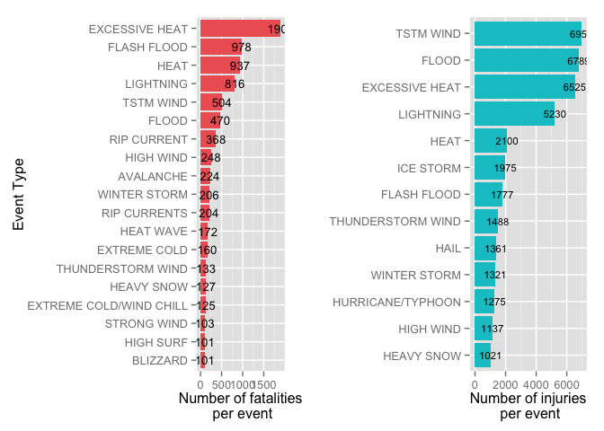
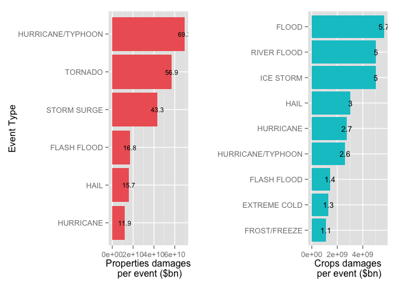

# Analysis of impact of storms on population health and economy in USA


```r
# setwd("~/Google Drive/GitHub/Reproducible-Research/Peer Assessment 2")
library(R.utils)
```

```
## Loading required package: R.oo
## Loading required package: R.methodsS3
## R.methodsS3 v1.6.1 (2014-01-04) successfully loaded. See ?R.methodsS3 for help.
## R.oo v1.18.0 (2014-02-22) successfully loaded. See ?R.oo for help.
## 
## Attaching package: 'R.oo'
## 
## The following objects are masked from 'package:methods':
## 
##     getClasses, getMethods
## 
## The following objects are masked from 'package:base':
## 
##     attach, detach, gc, load, save
## 
## R.utils v1.34.0 (2014-10-07) successfully loaded. See ?R.utils for help.
## 
## Attaching package: 'R.utils'
## 
## The following object is masked from 'package:utils':
## 
##     timestamp
## 
## The following objects are masked from 'package:base':
## 
##     cat, commandArgs, getOption, inherits, isOpen, parse, warnings
```

```r
if (!"stormData.csv.bz2" %in% dir()) {
  download.file("http://d396qusza40orc.cloudfront.net/repdata%2Fdata%2FStormData.csv.bz2",destfile="stormData.csv.bz2")
  bunzip2("stormData.csv.bz2", overwrite=T, remove=F)
  }
data= read.csv("stormData.csv")
```

## Summary

Database is from U.S. National Oceanic and Atmospheric Administration's (NOAA) which tracks characteristics of major storms and weather events in the United States, including when and where they occur, as well as estimates of any fatalities, injuries, and properties damage, covering period from the year 1950 to November 2011. In the earlier years of the database there are generally fewer events recorded, most likely due to a lack of good records. More recent years should be considered more complete. This report studies the number of fatalities and injuries, and economic damages of properties and crops valued in USD. It is found that several natural events led by tornado and flood is damaging population health and economy. Descriptions for variables can be found in original code book ([link](https://d396qusza40orc.cloudfront.net/repdata%2Fpeer2_doc%2Fpd01016005curr.pdf)).


## Data Processing

Irrelevant variables will be removed in specific analysis conducted below. 


```r
# libraries
library(reshape2)
library(ggplot2)
require(gridExtra)
```

```
## Loading required package: gridExtra
## Loading required package: grid
```

```r
require(dplyr)
```

```
## Loading required package: dplyr
## 
## Attaching package: 'dplyr'
## 
## The following object is masked from 'package:stats':
## 
##     filter
## 
## The following objects are masked from 'package:base':
## 
##     intersect, setdiff, setequal, union
```

```r
# new data set related to population health
ph=data[,c("EVTYPE","FATALITIES","INJURIES")]
phsum=as.data.frame(summarise(group_by(ph,EVTYPE),fatalities=sum(FATALITIES),injuries=sum(INJURIES)))
# remove events not threathening population health
phsumna=phsum[phsum$fatalities!=0 & phsum$injuries!=0,]


# new data set related to economic damage
ec=data[,c("EVTYPE","PROPDMG","PROPDMGEXP","CROPDMG","CROPDMGEXP")]
# apply damage explanation to damage amount
ec$PROPDMGEXP=as.character(ec$PROPDMGEXP)
ec$PROPDMGEXP=gsub("\\-|\\+|\\?|0","1",ec$PROPDMGEXP)
ec$PROPDMGEXP=gsub("b|B","9",ec$PROPDMGEXP)
ec$PROPDMGEXP=gsub("H|h","2",ec$PROPDMGEXP)
ec$PROPDMGEXP=gsub("k|K","3",ec$PROPDMGEXP)
ec$PROPDMGEXP=gsub("m|M","6",ec$PROPDMGEXP)
ec$PROPDMGEXP=as.numeric(ec$PROPDMGEXP)
ec$PROPDMGEXP[is.na(ec$PROPDMGEXP)]=0

ec$CROPDMGEXP=as.character(ec$CROPDMGEXP)
ec$CROPDMGEXP=gsub("\\-|\\+|\\?|0","1",ec$CROPDMGEXP)
ec$CROPDMGEXP=gsub("b|B","9",ec$CROPDMGEXP)
ec$CROPDMGEXP=gsub("H|h","2",ec$CROPDMGEXP)
ec$CROPDMGEXP=gsub("k|K","3",ec$CROPDMGEXP)
ec$CROPDMGEXP=gsub("m|M","6",ec$CROPDMGEXP)
ec$CROPDMGEXP=as.numeric(ec$CROPDMGEXP)
ec$CROPDMGEXP[is.na(ec$CROPDMGEXP)]=0

ec$PROPDMG = ec$PROPDMG*10^ec$PROPDMGEXP
ec$CROPDMG = ec$CROPDMG*10^ec$CROPDMGEXP

ecsum=as.data.frame(summarise(group_by(ec,EVTYPE),properties=sum(PROPDMG),crops=sum(CROPDMG)))
# remove events not causing economic damages
ecsumna=ecsum[ecsum$properties!=0 & ecsum$crops!=0,]
```

## Results

### Events that are most harmful to population health

Two variables in the original dataset are related to population health: 

+ Fatalities
+ Injuries    

The analysis will focus on these two variables to evaluate the scale of damage events have on population health.    

```r
phbytotal= phsumna %>%
  mutate(total=fatalities+injuries) %>%
  arrange(desc(total))
head(phbytotal,n=20)
```

```
##                EVTYPE fatalities injuries total
## 1             TORNADO       5633    91346 96979
## 2      EXCESSIVE HEAT       1903     6525  8428
## 3           TSTM WIND        504     6957  7461
## 4               FLOOD        470     6789  7259
## 5           LIGHTNING        816     5230  6046
## 6                HEAT        937     2100  3037
## 7         FLASH FLOOD        978     1777  2755
## 8           ICE STORM         89     1975  2064
## 9   THUNDERSTORM WIND        133     1488  1621
## 10       WINTER STORM        206     1321  1527
## 11          HIGH WIND        248     1137  1385
## 12               HAIL         15     1361  1376
## 13  HURRICANE/TYPHOON         64     1275  1339
## 14         HEAVY SNOW        127     1021  1148
## 15           WILDFIRE         75      911   986
## 16 THUNDERSTORM WINDS         64      908   972
## 17           BLIZZARD        101      805   906
## 18                FOG         62      734   796
## 19        RIP CURRENT        368      232   600
## 20   WILD/FOREST FIRE         12      545   557
```

By observing priliminary analysis, it can be concluded that Tornado is the only event that can significantly damage population health, causing **5633** fatalities and **91.3** thousands injuries.   
In total **106** events have record of injuries or fatalities. To generate the most relevant results, only events that have caused more than 1000 injuries or injuries and fatalities combined, or caused more than 100 fatalities will be further analysed. 

The analysis will choose fatalities and injuries to suggest the top nature events harmful to the population. 


```r
phbyfatal=
  phsumna %>%
  arrange(desc(fatalities)) %>%
  filter(fatalities>= 100) %>%
  select(-injuries)

phbyfatal$EVTYPE= factor(phbyfatal$EVTYPE,levels=arrange(phbyfatal,fatalities)$EVTYPE)
p1= ggplot(phbyfatal[-1,],aes(y=fatalities,x=EVTYPE))+geom_bar(stat = "identity",fill="indianred2")+labs(x="Event Type", y="Number of fatalities\n per event")+ coord_flip()+geom_text(aes(label = fatalities), size = 3.5)


# only look at events with injuries over 1000
phbyinj= 
  phsumna %>%
  arrange(desc(injuries)) %>%
  filter(injuries>= 1000) %>%
  select(-fatalities)

phbyinj$EVTYPE= factor(phbyinj$EVTYPE,levels=arrange(phbyinj,injuries)$EVTYPE)
p2= ggplot(phbyinj[-1,],aes(y=injuries,x=EVTYPE))+geom_bar(stat = "identity",fill="turquoise3")+labs(x="",y="Number of injuries\n per event")+ coord_flip()+geom_text(aes(label = injuries), size = 3)

grid.arrange(p1, p2, ncol = 2)
```

 

Besides Tornado, these events listed are the top natural disasters that affect population health. 

Given the ranking of severity, the authority should be aware of these natural disasters accordingly and create procedures in pre-warning, dismissing and rescuing residents to reduce injuries and fatalities. 

### Events that create greatest most harmful economic consequences

Two variables in the original dataset are related to economic damages: 

+ properties damages
+ crops damages    

The analysis will focus on these two variables to evaluate the scale of damage events have on economy.    


```r
ecbytotal= ecsumna %>%
  mutate(total=properties+crops) %>%
  arrange(desc(total))
head(ecbytotal,n=20)
```

```
##                EVTYPE   properties       crops        total
## 1               FLOOD 144657709807  5661968450 150319678257
## 2   HURRICANE/TYPHOON  69305840000  2607872800  71913712800
## 3             TORNADO  56947382418   414954710  57362337128
## 4         STORM SURGE  43323536000        5000  43323541000
## 5                HAIL  15735269634  3025954653  18761224287
## 6         FLASH FLOOD  16822676332  1421317100  18243993432
## 7             DROUGHT   1046106000 13972566000  15018672000
## 8           HURRICANE  11868319010  2741910000  14610229010
## 9         RIVER FLOOD   5118945500  5029459000  10148404500
## 10          ICE STORM   3944928310  5022113500   8967041810
## 11     TROPICAL STORM   7703890550   678346000   8382236550
## 12       WINTER STORM   6688497260    26944000   6715441260
## 13          HIGH WIND   5270046610   638571300   5908617910
## 14           WILDFIRE   4765114000   295472800   5060586800
## 15          TSTM WIND   4484928990   554007350   5038936340
## 16   STORM SURGE/TIDE   4641188000      850000   4642038000
## 17  THUNDERSTORM WIND   3483123642   414843050   3897966692
## 18     HURRICANE OPAL   3172846000    19000000   3191846000
## 19   WILD/FOREST FIRE   3001829500   106796830   3108626330
## 20 THUNDERSTORM WINDS   1944643132   190655508   2135298640
```

By observing priliminary analysis, it can be concluded that Flood is the only event that can significantly harm economy by causing $**144.7**bn USD properties damages and $**5.7**bn USD crops damages. 

In total **111** events have record of economic damages. To generate the most relevant results, only events that have caused more than $10bn damages on properties or properties & crops combined, or damages more than $1bn on crops will be further analysed. 

The analysis will choose three quantified amount of damages on properties and crops to suggest the top nature events harmful to the economy. 


```r
# only look at events with properties over $10bn
ecbyprop=
  ecsumna %>%
  arrange(desc(properties)) %>%
  filter(properties>= 10^10) %>%
  select(-crops)

ecbyprop$EVTYPE= factor(ecbyprop$EVTYPE,levels=arrange(ecbyprop,properties)$EVTYPE)
p1= ggplot(ecbyprop[-1,],aes(y=properties,x=EVTYPE))+geom_bar(stat = "identity",fill="indianred2")+labs(x="Event Type", y="Properties damages\n per event ($bn)")+ coord_flip()+geom_text(aes(label = round(properties/10^9,1)), size = 3)


# only look at events with crops over $10bn
ecbycrop=
  ecsumna %>%
  arrange(desc(crops)) %>%
  filter(crops>= 10^9) %>%
  select(-properties)

ecbycrop$EVTYPE= factor(ecbycrop$EVTYPE,levels=arrange(ecbycrop,crops)$EVTYPE)
p2= ggplot(ecbycrop[-1,],aes(y=crops,x=EVTYPE))+geom_bar(stat = "identity",fill="turquoise3")+labs(x="",y="Crops damages\n per event ($bn)")+ coord_flip()+geom_text(aes(label = round(crops/10^9,1)), size = 3.5)

grid.arrange(p1, p2, ncol = 2)
```

 

Besides Flood, these events listed are the top natural disasters that do economic damages. 

Given the ranking of severity, the authority should be aware of these natural disasters accordingly and create procedures to reduce economic damages.


### Limitations 

There are several limitations besides those listed in original codebook.  	

+ All time period covered by original database is used in analysis. As given in the original codebook, it was only until recent years that such natural disasters were properly recorded. Including all time period may have an impact on the results since it is probable that only serious events were recorded in the past, casting the total quantified damages caused. 	
+ Some names of event may be spelled differently or misspelled. Events may be overlapped since multiple events may have happened at the same time. This will separate data within same classification and lead to inaccuracy. The problem is not addressed in the data processing due to tight deadline.  
+ Economic damages may be estimated figures. This will surely affect the accuracy of results.		
